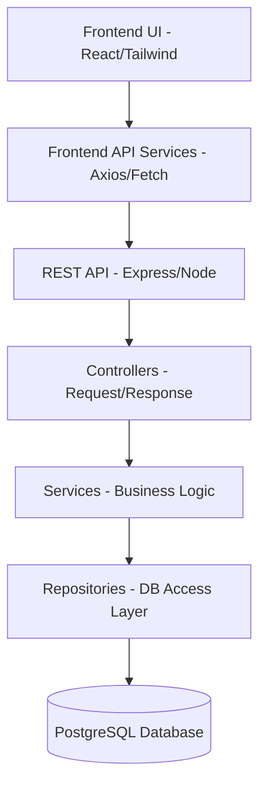

# Architecture Overview

## Foundation

The ELECTROMART platform follows a strict tiered architecture separating the UI, Frontend Business Logic, API, Backend Business Logic, and Persistence layers.

## Layers

1. **Frontend UI**: Presentation layer using React components, layouts, and pages. It should NOT contain complex data fetching or business logic.
2. **Frontend Services**: Encapsulates all API communication. React hooks/components must call these services instead of calling `fetch` or `axios` directly.
3. **REST API (Controllers)**: Receives HTTP requests, validates input schemas, and passes data to backend services. Maps service responses back to HTTP responses.
4. **Backend Services**: Contains the core business rules (e.g. calculating sourcing plans, validating component-supplier mapping).
5. **Repositories**: The only layer allowed to execute PostgreSQL queries. Hides the DB details from the business logic.

## Principles

- **No Direct DB Access from Controllers**: Controllers must go through Services/Repositories.
- **Canonical Components vs Supplier Offers**: The database models a single "Canonical Component" that can have multiple "Supplier-Specific Offers".
- **Security**: JWT-based authentication with role-based authorization (Customer, Supplier, Admin).
